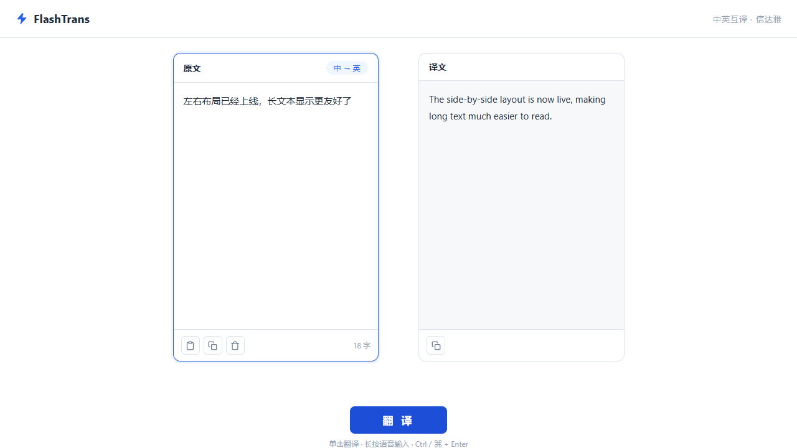

# FlashTrans · 中英互译

极简蓝白风格的中英互译工具。输入中文自动译为英文，输入英文自动译为中文，译力求**信、达、雅**。



**在线使用**：https://swyu22.github.io/FlashTrans/

## 功能

- 左右双栏：左输入、右输出，流式逐字出译文
- 自动识别翻译方向（中 ⇄ 英），界面实时显示当前方向
- 输入区：粘贴 / 复制 / 清空；输出区：一键复制
- `Ctrl / ⌘ + Enter` 快捷翻译，移动端自适应

## 架构

纯静态前端 + Cloudflare Worker 代理：

```
浏览器 (GitHub Pages)  ──►  Cloudflare Worker  ──►  DeepSeek API
     index.html              api.flashtrans.xyz        deepseek-chat
     style.css               限流 / 选提示词 / 转发
     app.js                  密钥与提示词均为
                            Cloudflare Secrets
```

- **前端**（仓库根目录）：零构建纯静态三件套，由 GitHub Pages 直接托管，支持 PWA（可添加到主屏幕）。
- **后端**（`worker/`）：Cloudflare Worker，绑定自定义域名 `api.flashtrans.xyz`（同时保留默认 workers.dev 路由），负责按 IP 限流（每分钟 20 次 / 每天 200 次）、单次输入截断（8000 字符）、方向检测、转发 DeepSeek 并透传 SSE 流。

## 安全说明

**本仓库不含任何 API Key 与翻译提示词明文。** DeepSeek API Key 和两条翻译提示词均以 Cloudflare Secrets 加密注入 Worker（`wrangler secret put`），源码中仅有 `env.*` 引用；前端代码中没有任何机密信息。

## 本地开发

```bash
# 前端（任意静态服务器）
python -m http.server 8000

# Worker
cd worker
npm install
npx wrangler dev
```

## 部署

```bash
# 1. 前端：推送到 main 后，仓库 Settings → Pages → Source 选 main / (root)

# 2. Worker
cd worker
npx wrangler login
npx wrangler deploy

# 3. 注入机密（不会进入 git）
npx wrangler secret put DEEPSEEK_API_KEY
npx wrangler secret put PROMPT_ZH2EN    # 粘贴中→英提示词
npx wrangler secret put PROMPT_EN2ZH    # 粘贴英→中提示词

# 4. 将 app.js 中 WORKER_URL 改为部署后的 Worker 地址
```

## License

MIT
